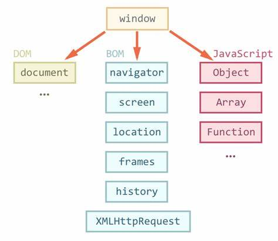

## Browser environment, specs

- The JavaScript language was initially created for web browsers. Since then, it has evolved into a language with many uses and platforms.

- A platform may be a browser, or a web-server or another host, or even a “smart” coffee machine if it can run JavaScript. Each of these provides platform-specific functionality. The JavaScript specification calls that a host environment.



**=> There’s a “root” object called window. It has two roles:**

1) First, it is a global object for JavaScript code, as described in the chapter Global object.

2) Second, it represents the “browser window” and provides methods to control it.


## DOM(Document Object Model)

- The Document Object Model, or DOM for short, represents all page content as objects that can be modified.

- The document object is the main “entry point” to the page. We can change or create anything on the page using it.

<h1>Example </h1>

```javascript
// change the background color to red
document.body.style.background = "red";

// change it back after 1 second
setTimeout(() => document.body.style.background = "", 1000);
```

## BOM (Browser Object Model)

- The Browser Object Model (BOM) represents additional objects provided by the browser (host environment) for working with everything except the document.

<h1>Example</h1>

```javascript
alert(location.href); // shows current URL
if (confirm("Go to Wikipedia?")) {
  location.href = "https://wikipedia.org"; // redirect the browser to another URL
}
```

=> The location object allows us to read the current URL and can redirect the browser to a new one.

## DOM Tree

**Let's understand with example:**


## Walking the DOM

- The DOM allows us to do anything with elements and their contents, but first we need to reach the corresponding DOM object.

- All operations on the DOM start with the document object. That’s the main “entry point” to DOM. From it we can access any node.

**Let's see DOM nodes:**


The topmost tree nodes are available directly as document properties:

``<html>`` = document.documentElement
The topmost document node is document.documentElement. That’s the DOM node of the ``<html>`` tag.

``<body>`` = document.body
Another widely used DOM node is the ``<body>`` element – document.body.

``<head>`` = document.head
The ``<head>`` tag is available as document.head.

**Children: childNodes, firstChild, lastChild**

There are two terms that we’ll use from now on:

- Child nodes (or children) – elements that are direct children. In other words, they are nested exactly in the given one. For instance, `<head>` and `<body>` are children of `<html>` element.
- Descendants – all elements that are nested in the given one, including children, their children and so on.