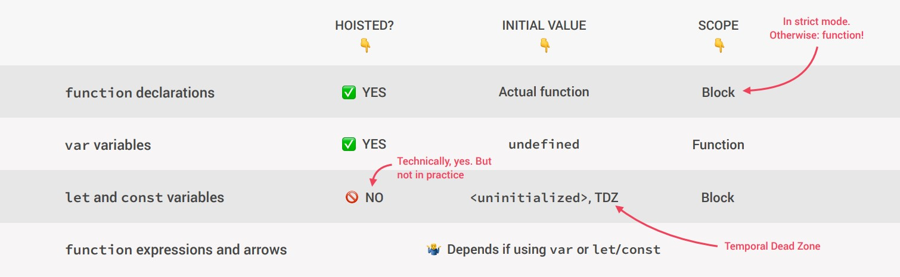
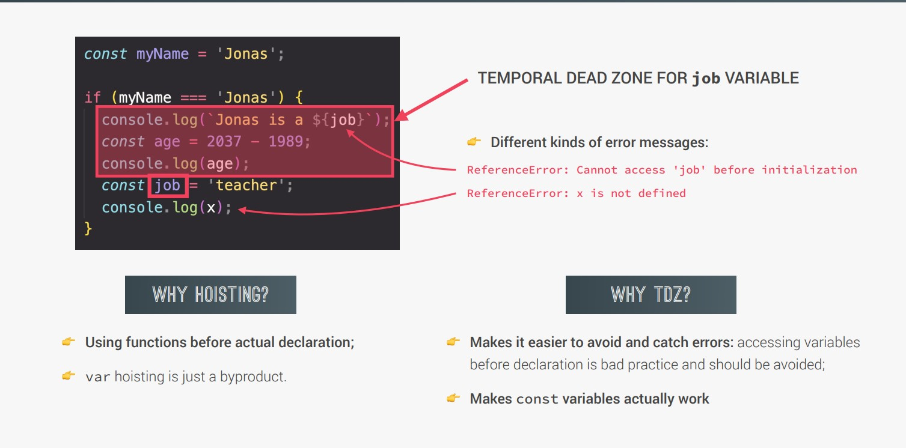

## What is Hoisiting?

- Makes some types of variables accessible/usable in the code before they are
actually declared. “Variables lifted to the top of their scope.

- JavaScript Hoisting refers to the process whereby the interpreter appears to move the declaration of functions, variables or classes to the top of their scope, prior to execution of the code.

- Hoisting is not a term normatively defined in the ECMAScript specification. The spec does define a group of declarations as HoistableDeclaration, but this only includes function, function*, async function, and async function* declarations. Hoisting is often considered a feature of var declarations as well, although in a different way. In colloquial terms, any of the following behaviors may be regarded as hoisting

- The four function declarations above are hoisted with type 1 behavior; var declaration is hoisted with type 2 behavior; let, const, and class declarations (also collectively called lexical declarations) are hoisted with type 3 behavior.

## Where does Hoisting concepts work?




## Using let and const keywords.

- Variables defined with let and const are hoisted to the top of the block, but not initialized.

- Meaning: The block of code is aware of the variable, but it cannot be used until it has been declared.

- Using a let variable before it is declared will result in a ReferenceError.

- The variable is in a "temporal dead zone" from the start of the block until it is declared:

### Example

```javascript
firstname = "nistha"
let firstname;

// it will give reference error.
```

## What is TDZ?



