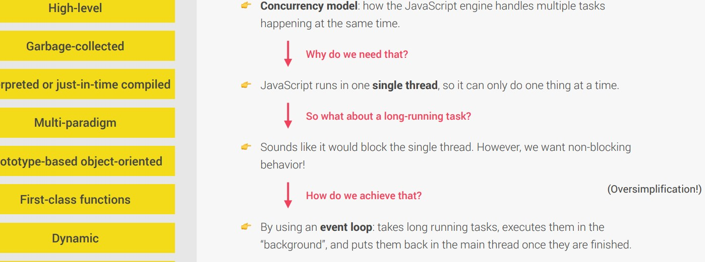

## High-level overview of JavaScript

- JavaScript is high level language and developer no need to worry, everything happens automatically.

- JavaScript is Interpreted or just-in time compiled language.

- JavaScript is Multi-Paradigm programming language.
   ### What is paradign?
   - An approach and mindset of structuring code, which will direct your coding style and technique.

=> **JavaScript is :**

 1) Procedural programming

 2) Object- Oriented Programming

 3) Functional Programming

