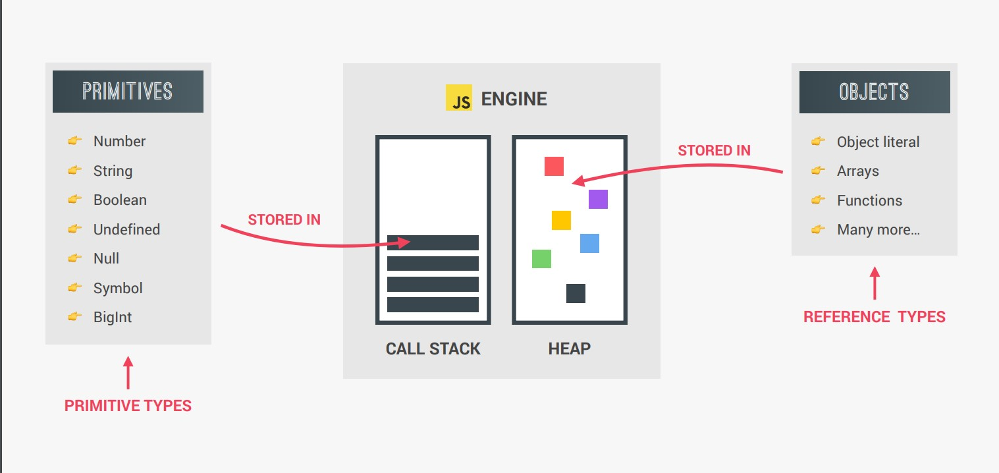

- Primitive values can be stored in variables directly. Objects, on the other hand, are stored as references. A variable that has been assigned an object does not store that object directly, it stores the memory address of the location that the object exists at.

Example:

```javascript
const me = {
  name: 'Jonas',
  age: 30,
};
const friend = me;
friend.age = 27;
console.log('Friend:', friend);
console.log('Me', me);
```
**=> In above example for object me age value assigns to 27 and friend name object is also created and age value is 27.**



**Explaination of above example**


## Copying objects

```javascript
const jessica2 = {
  firstName: 'Jessica',
  lastName: 'Williams',
  age: 27,
  family: ['Alice', 'Bob'],
};
const jessicaCopy = Object.assign({}, jessica2);
jessicaCopy.lastName = 'Davis';
jessicaCopy.family.push('Mary');
jessicaCopy.family.push('John');
console.log('Before marriage:', jessica2);
console.log('After marriage: ', jessicaCopy);
```

=> new Object is copy to jessicacopy. and to see old last name value used assign() to assign old last name value and console as jessica2.