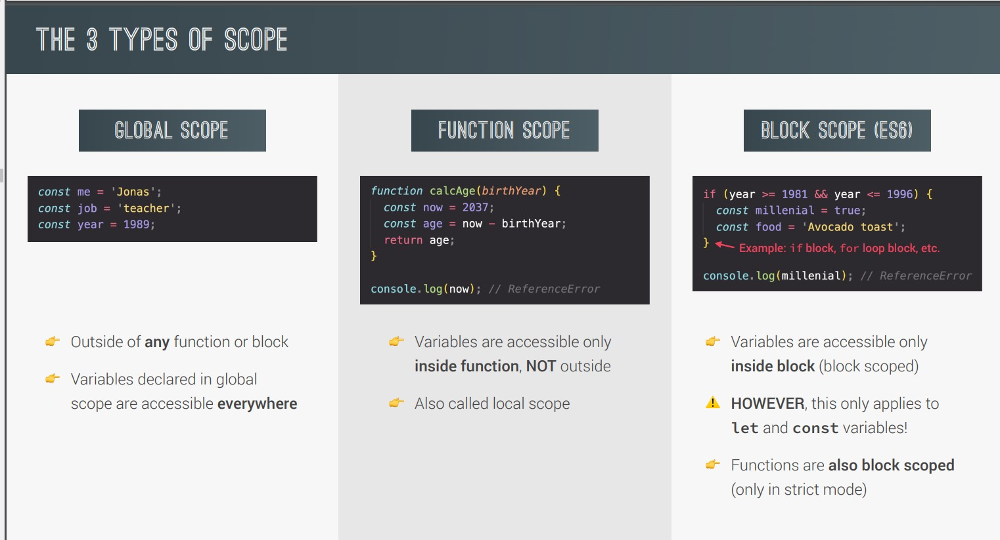
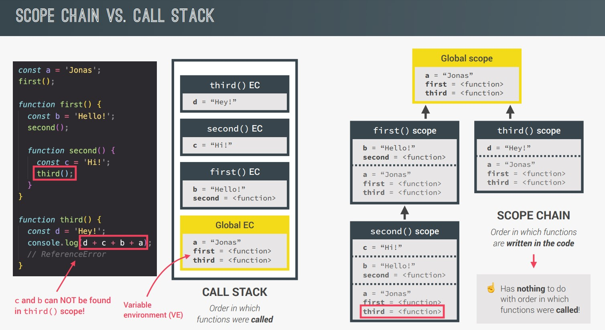
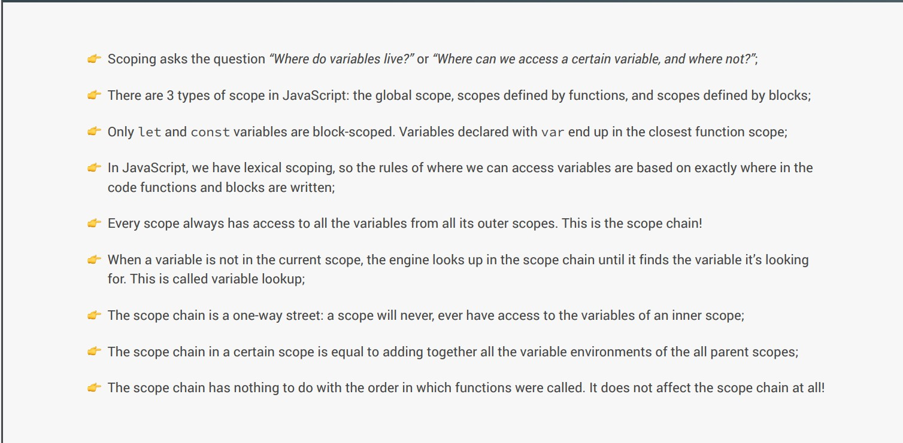

## What is scoping?

- How our programs variable are organized and accessed. "Where do variables live?" or "Where we can access certail variables or where not?"


## What is lexical scoping?

- Scoping is controlled by where we exactly write our functions and code blocks.


## What is scope?

- Space or enviorment in which certain variables are declared. There is global scope, function scope and block scope.

## What is scope of variable?

- Region of our code where a certain variable can be accessed.


### Three types of Scope

1) Global Scope

2) Function Scope

3) Block Scope(ES6)




<h1>Let's see details Example</h1>

**=> In this Example, const `myname ="jonas"` is Global Scope.
then function `first()` and `second()` is having their own function scope.
and under first function there is if condtion and varaibles `decade` is block scope where `var millenial = true` is function scope because block scope only works for `let` and `const`.**


## Example:


```javascript
'use strict';
function calcAge(birthYear) {
  const age = 2037 - birthYear;
  function printAge() {
    let output = `${firstName}, you are ${age}, born in ${birthYear}`;
    console.log(output);
    if (birthYear >= 1981 && birthYear <= 1996) {
      var millenial = true;
      // Creating NEW variable with same name as outer scope's variable
      const firstName = 'Steven';
      // Reasssigning outer scope's variable
      output = 'NEW OUTPUT!';
      const str = `Oh, and you're a millenial, ${firstName}`;
      console.log(str);
    }
    // console.log(str);
    console.log(millenial);
    console.log(output);
  }
  printAge();
  return age;
}
const firstName = 'Jonas';
calcAge(1991);

//output
Jonas, you are 46, born in 1991
Oh, and youre a millenial, Steven
true
NEW OUTPUT!
```

**=> In above example `firtName` variable is global scope so it is printed first and then `calcAge` function is called execution will go to function scope and calculate age and then `printAge` function will printed and ouput varibale will be printed. Under if there is const variable name as millenial so it is block scope so in str it is printed**


## Scope chain VS Call Stack



## Summary of Scope chain




