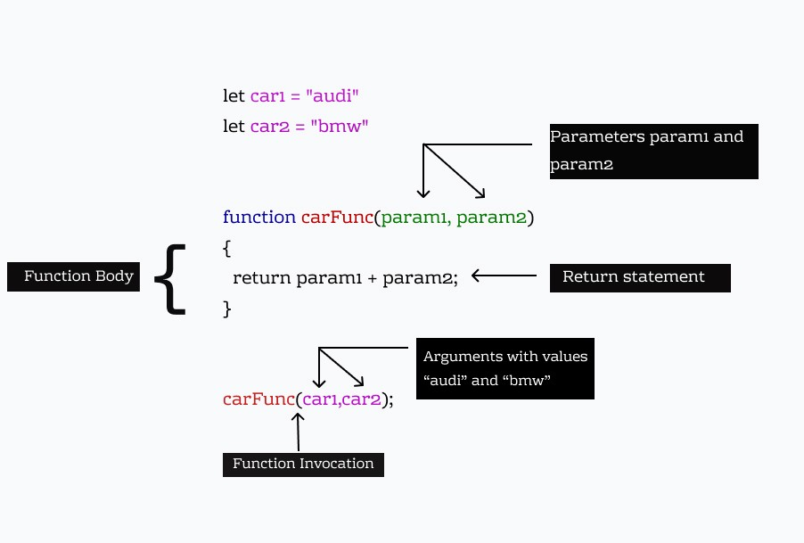
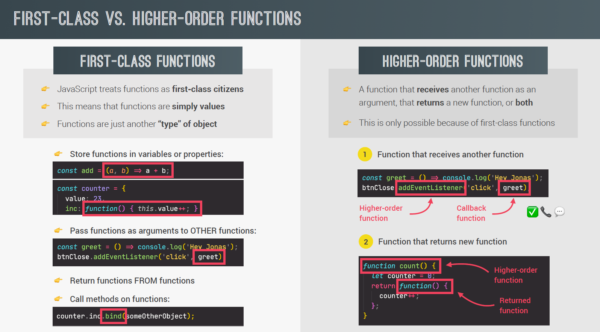

## What is functions?

// function declaration

- In general meaning, a function is piece of code that we can use again n over again.

<h1>Syntax:</h1>

```javascript
function myFunction(){
    --- logic----
}
myFunction();   // call function
```
<h1>Example: </h1>

```javascript
function sayHello(){
    console.log("Hello world!");
}
sayHello();
```





**For better understanding let's understand with another example**

```javascript
function fruitProcessor(apples,oranges){
    console.log(apples,oranges);
    const juice = `Juice with ${apples} apples and ${oranges} oranges`;
    return juice;
}
fruitProcessor(5,0);

const applejuice = fruitProcessor(5,0);
console.log(applejuice);

// apples, oranges are parameter.
// 5,0 are arguments

//output
50
Juice with 5 apples and 0 oranges
```

// function expression


- Function expression means whole function is hold by one variable.

**Example:**

```javascript
const calcAge2 = function(birthYear){
    return 2037 -  birthYear;
}
console.log(calcAge2(1991));
```

<h1>How to call one function under another</h1>

- To call a function inside another function, define the inner function inside the outer function and invoke it. When using the function keyword, the function gets hoisted to the top of the scope and can be called from anywhere inside of the outer function.

**Example:**

```javascript
const cutPieces = function (fruit){
    return fruit * 4;
};
const fruitProcessor = function(apples , oranges){
    const applePieces = cutPieces(apples);
    const orangePieces = cutPieces(oranges);

    const juice = `Juice with ${applePieces} pieces of apples and ${orangePieces} pieces of oranges`;
    return juice;
};

console.log(fruitProcessor(3,4));

//output
Juice with 12 pieces of apples and 16 pieces of oranges
```

## Arguments keywords

=> Arguments keywords works only for regular functions.

```javascript
const addExpr = function (a, b) {
  console.log(arguments);
  return a + b;
};
addExpr(2, 5);
addExpr(2, 5, 8, 12);
var addArrow = (a, b) => {
  console.log(arguments);
  return a + b;
};
addArrow(2, 5, 8);
```

//output
```
0:2
1:5
```

## Default Parameters

- While using default value, expressions can also be used to calculate value of a parameter based on the value of parameter before it.

- You can't skip one parameter here. In order to do so you may just pass 'undefined'.


```js
const bookings = [];

const createBooking = function (
  flightNum,
  numPassengers = 1,
  price = 200 * numPassengers // Default value can be calculated as well. The parameters used in expression must be defined before
) {
  //   ES-5 way of doing things
  //   numPassengers = numPassengers || 1;
  //   price = price || 199;

  const booking = {
    flightNum,
    numPassengers,
    price,
  };

  console.log(booking);
  bookings.push(booking);
};

createBooking('LH123');
createBooking('LH123', 5);
createBooking('LH123', 3);
createBooking('LH123', 0);
createBooking('LH123', 3, 500);
// createBooking('LH123', , 500); // Gives error
createBooking('LH123', undefined, 100); // If you want to avoid passing numPassengers => Default value assigned*/
```

## Value vs reference

- When we pass primitive value, we are storing that value in a new variable defined in parameter of function statement and not passing the original value. So any change in parameter is not reflected in original value.

- When we pass reference value, we are passing the reference (that points to actual object in memory heap). If any changes are done here, the value at reference is changed and therefore reflected in the value outside function as well. **Changing these objects can be fatal to program and should be done carefully.**


## First class function and Higher order functions

- Functions are treated as value in JS. These functions can be passed as arguments, can be stored in variables and can be returned as well.

- Functions are just another type of objects in JS.

- A function is called higher order function if receives another function as an argument or returns a function or both.

- First class is just a feature that programming language either has or doesnot have. It means all functions are values so first class function is not in practice where as higher order function are in practice.



## Callback function

- Functions that are passed as an argument to another function are called callback functions. e.g.: event listeners, setTimeout etc.


## Immediately Invoked Function Expression(IIFE)

- These functions are executed only once. It works with arrow functions as well.

- It’s not much of a feature but rather a pattern/practice that developers picked up.

- Function is kept within ( ) and called immediately after declaration.

```js
const runOnce = function () {
  console.log(`This will run once`);
};

runOnce(); // This will run once
runOnce(); // This will run once

(function () {
  console.log(`run once`);
})(); // run once

(() => console.log(`This will also run once.`))(); // Works on arrow function as well | This will also run once
```


## Closures

- In closures, function always has access to the lexical scope where it was defined. Even if that function’s execution context is deleted from the call stack, it is still able to access its lexical environment.

```js
const secureBooking = function () {
  let passengerCount = 0;

  return function () {
    passengerCount++;
    console.log(`Passengers present: ${passengerCount}`);
  };
};

const booker = secureBooking();
booker(); // secure booking EC(Execution Context) is deleted but still remembers the passengerCount from lexical environment of its parent. || Passengers present: 1
booker(); // Passengers present: 2
booker(); // Passengers present: 3

const booker2 = secureBooking(); // creates a separate closure
booker2(); // Passengers present: 1 | booker2 has formed a separate closure and in its scope, passenerCount value will be different, hence makes the code reusable as well.
booker2(); // Passengers present: 2

console.dir(secureBooking);
console.dir(booker); // See in scopes --> Closures are available --> passengersCount is available.
console.dir(booker2);
```
